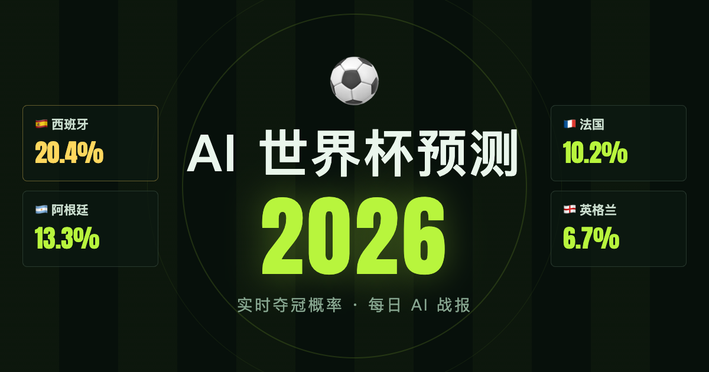

# ⚽ AI 世界杯预测 2026



> 在线演示：**https://worldcup.lightai.io** ｜ 纯 Python 标准库，零第三方依赖 ｜ MIT License

## 这是什么

又到世界杯了。四年前陪你看球的那个人，还在身边吗？

开幕那天闲着冒出个念头：**如果让 AI 把这届世界杯提前"踢"上一亿遍，它会看到什么？**
顺便正好测测 Claude（Fable 5）这类 AI 现在到底能干多少活——需求直接丢过去：
查 48 强真实分组、抓开赛日 Elo、写蒙特卡洛模拟器、做网站、配服务器、签 HTTPS，
连每日战报都由 AI 执笔。

## 它每天在做什么

服务器上的 cron 在每个比赛窗口自动跑一遍流水线：

```
抓最新比分 → 按 eloratings 公式更新各队 Elo → 攻防风格随实际进球微调
→ 已赛结果固定、未赛比赛融合最新盘口 → 蒙特卡洛重算整届赛事 → 刷新网站
```

爆冷会立刻反映到后续所有预测里；每场比赛的赛前预测会在开球前锁档，
赛后和实际比分对账——**预测战绩公开可查，包括打脸记录**。

## 网站板块

| 板块 | 内容 |
|---|---|
| 总览 | 夺冠概率榜（点队伍展开晋级漏斗 + 市场赔率对照）、夺冠概率走势图、最可能决赛 |
| 赛程·预测 | 全部 104 场，按阶段/状态/球队筛选；每场可点开：比分概率热力图、Top5 比分、盘口对照；已赛显示赛前预测 vs 实际 |
| 小组形势 | 12 组实时积分 + 出线/头名概率 |
| AI 战报 | 每日战报由 AI 执笔（先搜真实伤病/首发/剧情再下笔），底下还有一个叫 Fable 的 AI 跟评拆台 |
| 预测战绩 | 胜平负命中率、精确比分命中率、误差指数——全部基于赛前锁档的预测 |

右下角的分享按钮可以把任意板块导出成带二维码的长图（移动端长按保存，微信可用）。

## AI 是怎么算的

技术细节都在源码注释里，骨架是：

1. **动态 Elo**（eloratings.net 开赛日快照起步，赛后按 K=60 + 净胜球乘数更新）
   决定胜负期望；东道主全程 +60 主场加成。
2. 胜负期望 → **期望净胜球**（非线性映射），总进球围绕世界杯均值 2.6 浮动，
   双泊松生成比分，叠加 Dixon-Coles 低比分修正。
3. **攻防风格**（`src/strengths.py` 用历史赛果 IPF 拟合）只调比分形状，不改胜负——
   避免和 Elo 重复计价。
4. **盘口融合**：有盘口的比赛按 AI 0.7 + 市场 0.3 融合，开球前锁档进战绩。
5. **条件蒙特卡洛**：12 组 ×4 → 前二 + 8 个最佳第三 → FIFA 官方签表（Match 73–104），
   多进程并行，100 万次约半分钟；上线基线跑了 1 亿次。

## 快速开始

```bash
git clone https://github.com/vastxie/ai-worldcup-2026.git && cd ai-worldcup-2026
./update.sh --no-fetch      # 用仓库内的赛程快照重算（无需联网）
./update.sh                 # 联网抓最新比分后重算
python3 -m http.server 8642 --directory web   # 打开 http://localhost:8642

python3 -m src.predict match 西班牙 阿根廷 --knockout   # 单场预测
python3 -m src.record 1 2-1                             # 数据源挂了就手动录比分
python3 -m src.strengths fit --refresh                  # 重新拟合攻防风格
```

可选配置 `data/config.json`（模板见 `data/config.example.json`，已 gitignore）：
- the-odds-api key → 启用盘口融合（免费档每月 500 次够整届用）
- OpenAI 兼容接口 → 战报与单场看点自动生成（不配则人工/AI 会话执笔）

## 部署到你自己的服务器

- 任意小 VPS：nginx 静态托管 `web/` 目录，给 `index.html` 和 `data.js`/`reports.js`/`blurbs.js`
  加 `Cache-Control: no-cache`。
- cron 推荐 **UTC 19/21/23/01/03/05/07** 各跑一次 `./update.sh`（每批比赛开球 +3 小时，
  确保完赛出分；写 crontab 前先确认服务器时区）。
- 本地开发：复制 `.deploy.env.example` 为 `.deploy.env` 填入你的服务器，`./deploy.sh` 推代码。
- HTTPS：`sudo certbot --nginx -d 你的域名 --redirect`。

## 数据来源与致谢

基准 Elo：[eloratings.net](https://eloratings.net)；赛程与比分：[fixturedownload.com](https://fixturedownload.com)；
历史赛果：[martj42/international_results](https://github.com/martj42/international_results)（运行时自动下载）；
盘口：[the-odds-api.com](https://the-odds-api.com)（其数据有自身使用条款，缓存已 gitignore）。

## 已知简化

- 小组排名细则用「积分→净胜球→进球→随机」近似（未实现同分队对赛成绩与公平竞赛分）。
- 高原、酷暑、旅途疲劳未建模——盘口融合部分弥补，但若巴西在迈阿密一路狂奔，
  请记得是模型先认的输。
- Elo 系模型天然偏爱大热门；走势图会诚实记录它被打脸的全过程。

预测仅供学习娱乐，不构成任何投注建议——足球是圆的。🎲

---

> 🤖 本项目 100% 由 AI（Claude Fable 5）完成，不含任何手工代码——包括这句话。
